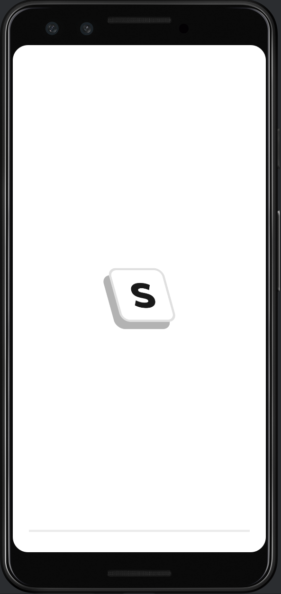
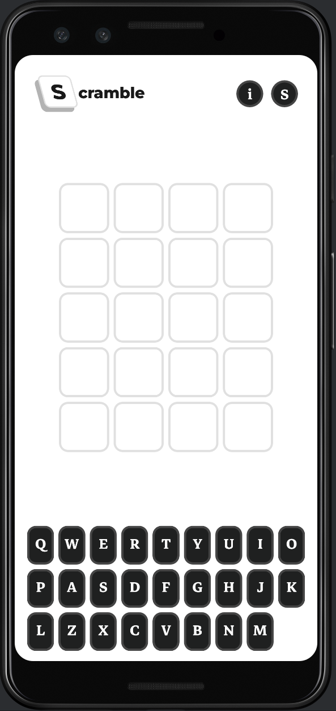
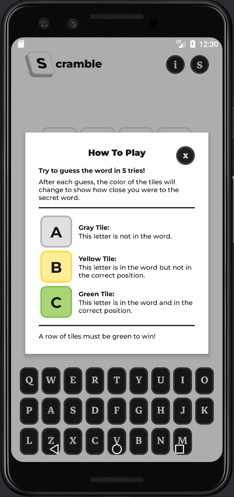
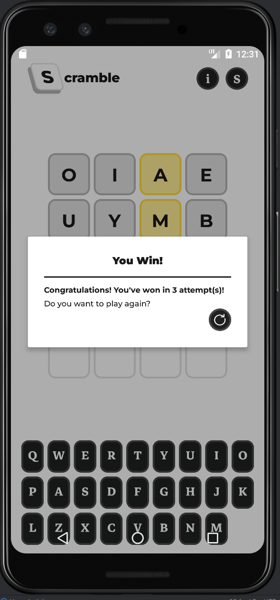
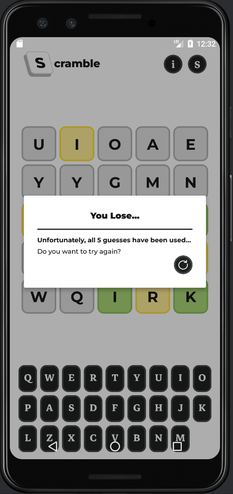

# Scramble Mobile Game Application
## Project Report
**What:**
Using Android Studio, I created the classic Wordle game with my own twist!

**How:**
This game comprises a single screen: The play screen where the player tries to guess the puzzle world.

## Mobile Application Screenshots

